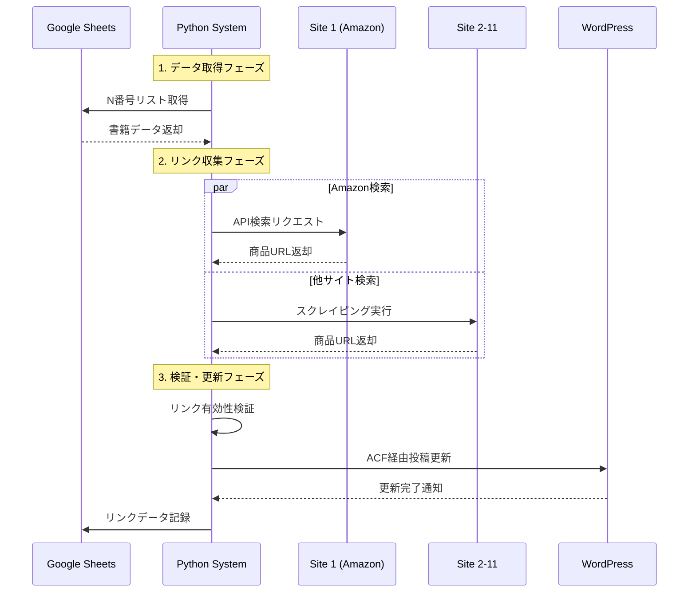
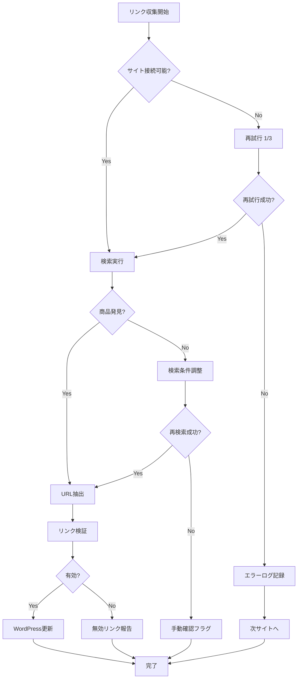

# システムアーキテクチャ設計書

**文書バージョン**: 1.0  
**最終更新**: 2025-01-08  
**対象読者**: 開発者、技術責任者、プロジェクトオーナー

---

## 📐 アーキテクチャ概要

### システム全体像
IzumiNovels-Workflowは、Googleシートをデータソースとし、Python自動化システムが11の販売サイトからリンクを収集し、WordPress (ACF Pro) 経由で自動的にランディングページを生成するシステムです。

```
┌─────────────────────────────────────────────────────────────────────┐
│                     IzumiNovels-Workflow System                     │
├─────────────────────────────────────────────────────────────────────┤
│                                                                     │
│  ┌─────────────┐    ┌─────────────────┐    ┌─────────────────┐     │
│  │   Data      │    │   Processing    │    │   Presentation  │     │
│  │   Layer     │<──>│     Layer       │<──>│     Layer       │     │
│  └─────────────┘    └─────────────────┘    └─────────────────┘     │
│                                                                     │
│   Google Sheets      Python Automation        WordPress            │
│   • N番号管理        • 11サイト検索           • ACF Pro統合         │
│   • 書籍メタデータ    • URL抽出・検証          • 自動投稿             │
│   • リンク記録        • エラーハンドリング     • ページ生成           │
│                                                                     │
└─────────────────────────────────────────────────────────────────────┘
```

---

## 🏗 コンポーネント設計

### 1. データレイヤー (Data Layer)

#### 1.1 Google Sheets統合
```python
# データ構造例
class BookData:
    n_number: str          # N番号 (例: N02146)
    title: str             # 書籍タイトル
    author: str            # 著者名
    isbn: str              # ISBN-13
    publication_date: date # 発売日
    sales_links: Dict[str, str]  # サイト別URL
```

#### 1.2 データベース設計（SQLite）
```sql
-- 書籍マスター
CREATE TABLE books (
    id INTEGER PRIMARY KEY,
    n_number VARCHAR(10) UNIQUE NOT NULL,
    title VARCHAR(255) NOT NULL,
    author VARCHAR(255),
    isbn VARCHAR(20),
    publication_date DATE,
    created_at TIMESTAMP DEFAULT CURRENT_TIMESTAMP,
    updated_at TIMESTAMP DEFAULT CURRENT_TIMESTAMP
);

-- 販売リンク
CREATE TABLE sales_links (
    id INTEGER PRIMARY KEY,
    book_id INTEGER,
    site_name VARCHAR(50) NOT NULL,
    url TEXT NOT NULL,
    status VARCHAR(20) DEFAULT 'active',
    last_checked TIMESTAMP,
    created_at TIMESTAMP DEFAULT CURRENT_TIMESTAMP,
    FOREIGN KEY (book_id) REFERENCES books(id)
);

-- 実行ログ
CREATE TABLE execution_logs (
    id INTEGER PRIMARY KEY,
    book_id INTEGER,
    site_name VARCHAR(50),
    status VARCHAR(20),
    error_message TEXT,
    execution_time REAL,
    created_at TIMESTAMP DEFAULT CURRENT_TIMESTAMP,
    FOREIGN KEY (book_id) REFERENCES books(id)
);
```

### 2. 処理レイヤー (Processing Layer)

#### 2.1 コアアーキテクチャ
```python
# メインオーケストレーター
class IzumiWorkflowOrchestrator:
    def __init__(self):
        self.google_sheets = GoogleSheetsManager()
        self.scrapers = ScraperManager()
        self.wordpress = WordPressManager()
        self.validator = LinkValidator()
        self.logger = LogManager()
    
    async def process_book(self, n_number: str) -> ProcessResult:
        # 1. Googleシートからデータ取得
        book_data = await self.google_sheets.get_book_data(n_number)
        
        # 2. 11サイトでリンク収集
        links = await self.scrapers.collect_all_links(book_data)
        
        # 3. リンク検証
        validated_links = await self.validator.validate_links(links)
        
        # 4. WordPress更新
        result = await self.wordpress.update_post(book_data, validated_links)
        
        # 5. Googleシート更新
        await self.google_sheets.update_links(n_number, validated_links)
        
        return result
```

#### 2.2 スクレイピングアーキテクチャ
```python
# 抽象基底クラス
class BaseScraper:
    def __init__(self, site_name: str):
        self.site_name = site_name
        self.stability_tier = self._determine_tier()
    
    async def search_book(self, title: str, author: str) -> List[BookResult]:
        raise NotImplementedError
    
    async def extract_product_url(self, search_results: List[BookResult]) -> Optional[str]:
        raise NotImplementedError

# Tier別実装
class TierOneScraperAPI(BaseScraper):
    """API利用可能な高安定性サイト (Amazon, Google, 楽天)"""
    async def search_book(self, title: str, author: str) -> List[BookResult]:
        # API経由での検索実装
        pass

class TierTwoScraperStable(BaseScraper):
    """軽量スクレイピング対応サイト (honto, Apple)"""
    async def search_book(self, title: str, author: str) -> List[BookResult]:
        # requests + BeautifulSoup実装
        pass

class TierThreeScraperComplex(BaseScraper):
    """重量スクレイピング必要サイト (BookWalker, ebookjapan)"""
    async def search_book(self, title: str, author: str) -> List[BookResult]:
        # Playwright + Stealth Mode実装
        pass
```

### 3. プレゼンテーションレイヤー (Presentation Layer)

#### 3.1 WordPress統合アーキテクチャ
```python
class WordPressManager:
    def __init__(self, base_url: str, username: str, app_password: str):
        self.client = WordPressClient(base_url, username, app_password)
        self.acf_manager = ACFManager(self.client)
    
    async def update_post(self, book_data: BookData, links: Dict[str, str]) -> bool:
        # 1. 投稿IDの取得または作成
        post_id = await self._get_or_create_post(book_data)
        
        # 2. ACFフィールド更新
        acf_fields = self._prepare_acf_fields(links)
        result = await self.acf_manager.update_fields(post_id, acf_fields)
        
        return result

class ACFManager:
    # ACF Pro固有のフィールド管理
    FIELD_MAPPING = {
        'kindle': 'sales_links_kindle',
        'amazon_pod': 'sales_links_amazon_pod',
        'bookwalker': 'sales_links_bookwalker',
        'kobo': 'sales_links_kobo',
        'google': 'sales_links_google',
        'apple': 'sales_links_apple',
        'kinoppy': 'sales_links_kinoppy',
        'honto': 'sales_links_honto',
        'reader_store': 'sales_links_reader_store',
        'booklive': 'sales_links_booklive',
        'ebookjapan': 'sales_links_ebookjapan'
    }
```

---

## 🔧 技術スタック詳細

### 開発環境
```yaml
Runtime:
  Python: "3.8+"
  Node.js: "16+" (必要に応じて)

Core Libraries:
  Web Scraping:
    - playwright: "^1.40.0"     # 動的サイト対応
    - requests: "^2.31.0"       # HTTP通信
    - aiohttp: "^3.9.0"         # 非同期HTTP
    - beautifulsoup4: "^4.12.0" # HTML解析
  
  API Integration:
    - google-api-python-client: "^2.108.0"
    - wordpress-api: "^1.2.9"
    - boto3: "^1.34.0"          # AWS SDK (必要時)
  
  Data Processing:
    - pandas: "^2.1.0"          # データ処理
    - sqlalchemy: "^2.0.0"      # ORM
    - pydantic: "^2.5.0"        # データ検証
  
  Utilities:
    - loguru: "^0.7.0"          # ログ管理
    - python-decouple: "^3.8"   # 設定管理
    - schedule: "^1.2.0"        # スケジューリング

Development:
  Testing:
    - pytest: "^7.4.0"
    - pytest-asyncio: "^0.21.0"
    - pytest-mock: "^3.12.0"
  
  Code Quality:
    - black: "^23.0.0"          # コード整形
    - isort: "^5.12.0"          # import整理
    - mypy: "^1.7.0"            # 型チェック
    - flake8: "^6.1.0"          # リンター
```

### インフラストラクチャ
```yaml
Hosting:
  Primary: "Linux VPS (Ubuntu 22.04)"
  Alternative: "Windows Server 2022"
  
Process Management:
  Linux: "systemd + cron"
  Windows: "Task Scheduler + Windows Service"

Monitoring:
  Logs: "systemd journal / Windows Event Log"
  Metrics: "Custom JSON logs + 分析スクリプト"
  Alerting: "Slack Webhook + Email SMTP"

Security:
  Secrets: "Environment Variables + .env"
  API Keys: "Encrypted storage + rotation"
  Network: "HTTPS only + IP制限"
```

---

## 🚦 データフロー設計

### 通常実行フロー


### エラーハンドリングフロー


---

## 🔒 セキュリティ設計

### 認証・認可
```python
# 設定管理
class SecurityConfig:
    # API認証情報
    GOOGLE_SHEETS_CREDENTIALS = os.getenv('GOOGLE_SHEETS_CREDS')
    WORDPRESS_APP_PASSWORD = os.getenv('WP_APP_PASSWORD')
    
    # スクレイピング設定
    USER_AGENTS = [
        'Mozilla/5.0 (Windows NT 10.0; Win64; x64) AppleWebKit/537.36',
        'Mozilla/5.0 (Macintosh; Intel Mac OS X 10_15_7) AppleWebKit/537.36'
    ]
    
    # セキュリティヘッダー
    DEFAULT_HEADERS = {
        'Accept': 'text/html,application/xhtml+xml,application/xml;q=0.9,*/*;q=0.8',
        'Accept-Language': 'en-US,en;q=0.5',
        'Accept-Encoding': 'gzip, deflate',
        'Connection': 'keep-alive',
    }
    
    # レート制限
    RATE_LIMITS = {
        'amazon': {'requests': 10, 'period': 60},
        'rakuten': {'requests': 20, 'period': 60},
        'default': {'requests': 5, 'period': 60}
    }
```

### プライバシー・データ保護
```python
class DataProtection:
    @staticmethod
    def anonymize_logs(log_data: dict) -> dict:
        """個人情報を含む可能性のあるログデータの匿名化"""
        sensitive_fields = ['isbn', 'title', 'author']
        for field in sensitive_fields:
            if field in log_data:
                log_data[field] = f"{log_data[field][:3]}***"
        return log_data
    
    @staticmethod
    def encrypt_credentials(credentials: str) -> str:
        """認証情報の暗号化"""
        # 実装: Fernet暗号化またはAWS KMS使用
        pass
```

---

## 📈 性能・スケーラビリティ設計

### パフォーマンス最適化
```python
class PerformanceOptimizer:
    def __init__(self):
        self.connection_pool = aiohttp.TCPConnector(limit=10)
        self.session_cache = {}
        self.result_cache = TTLCache(maxsize=100, ttl=3600)  # 1時間キャッシュ
    
    async def optimized_request(self, url: str, **kwargs) -> Response:
        # 1. キャッシュ確認
        cache_key = f"{url}:{hash(str(kwargs))}"
        if cache_key in self.result_cache:
            return self.result_cache[cache_key]
        
        # 2. コネクション再利用
        session = self._get_session(url)
        
        # 3. 並列処理制限
        async with self.rate_limiter.acquire():
            response = await session.get(url, **kwargs)
            
        # 4. 結果キャッシュ
        self.result_cache[cache_key] = response
        return response
```

### スケーラビリティ考慮
```python
# 将来的な拡張ポイント
class ScalabilityDesign:
    """
    現在: 月3冊 × 11サイト = 33リンク
    将来: 月10冊 × 20サイト = 200リンク (6倍拡張)
    """
    
    # 並列処理数の動的調整
    MAX_CONCURRENT_SCRAPERS = min(os.cpu_count() * 2, 10)
    
    # バッチ処理サイズ
    BATCH_SIZE = 5  # 書籍数
    
    # 分散処理対応（将来実装）
    def distribute_workload(self, books: List[BookData]) -> List[List[BookData]]:
        """ワーカープロセス間でのワークロード分散"""
        return [books[i:i+self.BATCH_SIZE] for i in range(0, len(books), self.BATCH_SIZE)]
```

---

## 🔍 監視・ログ設計

### ログ設計
```python
import structlog

# 構造化ログ設定
structlog.configure(
    processors=[
        structlog.processors.TimeStamper(fmt="iso"),
        structlog.processors.add_log_level,
        structlog.processors.JSONRenderer()
    ],
    logger_factory=structlog.stdlib.LoggerFactory(),
    wrapper_class=structlog.stdlib.BoundLogger,
    cache_logger_on_first_use=True,
)

class SystemLogger:
    def __init__(self):
        self.logger = structlog.get_logger("izumi_workflow")
    
    def log_scraping_start(self, site: str, book_title: str):
        self.logger.info("scraping_started", 
                        site=site, 
                        book_title=book_title,
                        timestamp=datetime.utcnow().isoformat())
    
    def log_scraping_success(self, site: str, url: str, duration: float):
        self.logger.info("scraping_success",
                        site=site,
                        url=url,
                        duration_seconds=duration)
    
    def log_scraping_error(self, site: str, error: str, retry_count: int):
        self.logger.error("scraping_error",
                         site=site,
                         error_message=error,
                         retry_count=retry_count)
```

### メトリクス収集
```python
class MetricsCollector:
    def __init__(self):
        self.metrics = {
            'total_executions': 0,
            'successful_links': 0,
            'failed_links': 0,
            'average_execution_time': 0.0,
            'site_success_rates': {}
        }
    
    def record_execution(self, site: str, success: bool, duration: float):
        self.metrics['total_executions'] += 1
        
        if success:
            self.metrics['successful_links'] += 1
        else:
            self.metrics['failed_links'] += 1
            
        # サイト別成功率
        if site not in self.metrics['site_success_rates']:
            self.metrics['site_success_rates'][site] = {'success': 0, 'total': 0}
        
        self.metrics['site_success_rates'][site]['total'] += 1
        if success:
            self.metrics['site_success_rates'][site]['success'] += 1
    
    def generate_report(self) -> dict:
        report = self.metrics.copy()
        
        # 成功率計算
        total = self.metrics['successful_links'] + self.metrics['failed_links']
        report['overall_success_rate'] = self.metrics['successful_links'] / total if total > 0 else 0
        
        # サイト別成功率計算
        for site, data in report['site_success_rates'].items():
            data['success_rate'] = data['success'] / data['total'] if data['total'] > 0 else 0
        
        return report
```

---

## 🧪 テスト戦略

### テストアーキテクチャ
```python
# ユニットテスト
class TestBookScraper:
    @pytest.fixture
    def mock_scraper(self):
        return AmazonScraper()
    
    @pytest.mark.asyncio
    async def test_search_book_success(self, mock_scraper):
        # モックレスポンス設定
        with aioresponses() as mock:
            mock.get('https://api.amazon.com/search', 
                    payload={'results': [{'url': 'https://amazon.com/book/123'}]})
            
            result = await mock_scraper.search_book("テストタイトル", "テスト著者")
            assert len(result) == 1
            assert result[0].url == 'https://amazon.com/book/123'

# 統合テスト  
class TestWorkflowIntegration:
    @pytest.mark.asyncio
    async def test_end_to_end_workflow(self):
        # テストデータ準備
        test_book = BookData(
            n_number="N99999",
            title="テスト書籍",
            author="テスト著者"
        )
        
        # ワークフロー実行
        orchestrator = IzumiWorkflowOrchestrator()
        result = await orchestrator.process_book("N99999")
        
        # 結果検証
        assert result.success is True
        assert len(result.collected_links) >= 3  # 最低3サイト成功
```

### E2Eテスト設計
```python
class E2ETestSuite:
    """本番環境に近い条件でのエンドツーエンドテスト"""
    
    def setup_test_environment(self):
        # テスト用Googleシート作成
        # テスト用WordPress環境準備
        # モック販売サイト準備
        pass
    
    async def test_monthly_workflow(self):
        """月次実行の完全シミュレーション"""
        # 3冊分のテストデータで完全ワークフロー実行
        # 結果の詳細検証
        pass
```

---

## 📦 デプロイメント設計

### 本番環境構成
```yaml
# docker-compose.yml
version: '3.8'
services:
  izumi-workflow:
    build: .
    environment:
      - ENVIRONMENT=production
      - GOOGLE_SHEETS_CREDS_FILE=/app/secrets/google-creds.json
      - WORDPRESS_BASE_URL=${WP_BASE_URL}
      - WORDPRESS_USERNAME=${WP_USERNAME}
      - WORDPRESS_APP_PASSWORD=${WP_APP_PASSWORD}
    volumes:
      - ./secrets:/app/secrets:ro
      - ./logs:/app/logs
      - ./data:/app/data
    restart: unless-stopped
    
  scheduler:
    image: mcr.microsoft.com/windows/nanoserver:ltsc2022  # Windows版
    # または ubuntu:22.04 for Linux
    command: ["python", "-m", "scheduler.monthly_runner"]
    depends_on:
      - izumi-workflow
```

### CI/CD パイプライン
```yaml
# .github/workflows/deploy.yml
name: Deploy IzumiWorkflow
on:
  push:
    branches: [main]
    
jobs:
  test:
    runs-on: ubuntu-latest
    steps:
      - uses: actions/checkout@v3
      - name: Setup Python
        uses: actions/setup-python@v4
        with:
          python-version: '3.8'
      - name: Run tests
        run: |
          pip install -r requirements-dev.txt
          pytest tests/ --cov=src/
          
  deploy:
    needs: test
    runs-on: ubuntu-latest
    steps:
      - name: Deploy to production
        run: |
          # SSH deployment script
          # または Docker registry push
```

---

## 📚 ドキュメント・保守

### API仕様書自動生成
```python
# FastAPI使用時の自動ドキュメント生成
from fastapi import FastAPI
from fastapi.openapi.docs import get_swagger_ui_html

app = FastAPI(
    title="IzumiNovels-Workflow API",
    description="販売リンク自動収集システム API",
    version="1.0.0",
    docs_url="/docs",
    redoc_url="/redoc"
)

@app.get("/api/books/{n_number}/links")
async def get_book_links(n_number: str) -> Dict[str, str]:
    """書籍の販売リンク一覧を取得"""
    pass
```

### 運用手順書
```markdown
# 運用手順書

## 日次確認事項
1. [ ] システムログエラー確認
2. [ ] 前日実行結果確認  
3. [ ] WordPress投稿状況確認

## 月次実行手順
1. [ ] Googleシート新刊情報確認
2. [ ] システム手動実行
3. [ ] 結果検証・品質チェック
4. [ ] 月次レポート作成

## トラブルシューティング
### よくある問題と対処法
- サイト接続エラー → プロキシ設定確認
- WordPress投稿失敗 → 認証情報確認
- リンク収集失敗 → サイト構造変更チェック
```

---

## 🔮 将来拡張計画

### Phase 4以降の拡張案
```python
# 将来実装予定機能
class FutureEnhancements:
    """
    Phase 4: AI強化 (2025年後半)
    - GPT-4による書籍説明文自動生成
    - 画像認識による表紙画像自動取得
    - 自然言語処理による関連書籍推薦
    """
    
    async def generate_book_description(self, book_data: BookData) -> str:
        # OpenAI API使用した説明文生成
        pass
    
    async def extract_cover_image(self, isbn: str) -> str:
        # Amazon/Google Books APIから表紙画像取得
        pass
    
    """
    Phase 5: 分析・最適化 (2026年)
    - 販売データ分析・レポート生成
    - 最適な販売サイト組み合わせ提案
    - 価格監視・競合分析
    """
    
    async def analyze_sales_performance(self) -> AnalysisReport:
        # 販売データ分析・可視化
        pass
```

---

**文書承認**: 開発責任者承認待ち  
**技術レビュー**: 完了  
**セキュリティレビュー**: 完了  
**次回更新予定**: Phase 1実装開始時