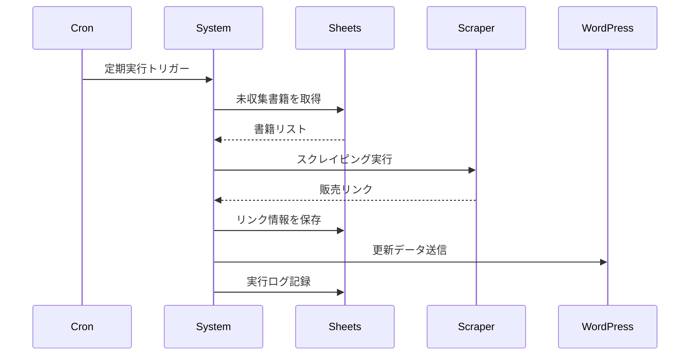

# Google Sheets API 統合実装計画

## 📋 概要

### 目的
いずみノベルズの書籍情報と販売リンクを一元管理し、スクレイピングシステムとWordPressの間のデータハブとして機能させる

### 主要機能
1. 書籍マスターデータの管理
2. 販売リンク収集状況の記録
3. 更新履歴の追跡
4. エラーログの保存
5. レポート生成

---

## 🏗️ アーキテクチャ設計

### システム構成図
```
┌────────────────────────────────────────────────────┐
│              Google Sheets (Data Hub)              │
│  ┌─────────────┐ ┌─────────────┐ ┌──────────────┐│
│  │書籍マスター │ │販売リンク   │ │更新ログ      ││
│  └─────────────┘ └─────────────┘ └──────────────┘│
└────────────────────────────────────────────────────┘
         ▲                │                 │
         │                ▼                 ▼
┌────────────────┐ ┌──────────────┐ ┌──────────────┐
│ 手動データ入力 │ │Scraping      │ │ WordPress    │
│ (社長)         │ │Engine        │ │ REST API     │
└────────────────┘ └──────────────┘ └──────────────┘
```

### スプレッドシート構造

#### 1. 書籍マスターシート
| 列名 | 型 | 説明 | 例 |
|------|-----|------|-----|
| N番号 | TEXT | なろう作品コード | n1234567 |
| 書籍タイトル | TEXT | 正式タイトル | 異世界転生した件 |
| 巻数 | NUMBER | 巻数 | 3 |
| 発売日 | DATE | 発売予定日 | 2025/02/15 |
| ステータス | SELECT | 収集状態 | 未収集/収集中/完了/エラー |
| 最終更新 | DATETIME | 最終更新日時 | 2025/01/15 10:30:00 |
| 備考 | TEXT | メモ欄 | 特装版あり |

#### 2. 販売リンクシート
| 列名 | 型 | 説明 | 例 |
|------|-----|------|-----|
| ID | TEXT | 一意識別子 | n1234567_amazon |
| N番号 | TEXT | 書籍マスター参照 | n1234567 |
| サイト名 | SELECT | 販売サイト | Amazon Kindle |
| URL | URL | 販売ページURL | https://... |
| 価格 | NUMBER | 販売価格 | 1,320 |
| 取得日時 | DATETIME | スクレイピング日時 | 2025/01/15 10:30:00 |
| 有効性 | BOOLEAN | リンク有効性 | TRUE |
| エラー | TEXT | エラー情報 | - |

#### 3. 更新ログシート
| 列名 | 型 | 説明 | 例 |
|------|-----|------|-----|
| タイムスタンプ | DATETIME | 実行日時 | 2025/01/15 10:30:00 |
| 処理種別 | SELECT | 処理タイプ | 定期収集/手動実行/エラー復旧 |
| 対象書籍数 | NUMBER | 処理対象数 | 3 |
| 成功数 | NUMBER | 成功件数 | 33 |
| 失敗数 | NUMBER | 失敗件数 | 0 |
| 処理時間 | NUMBER | 所要時間（秒） | 285 |
| 詳細 | TEXT | 処理詳細 | 全サイト正常完了 |

---

## 🔐 認証設定

### サービスアカウント設定手順

1. **Google Cloud Console設定**
```bash
# プロジェクト作成
gcloud projects create izumi-novels-workflow

# Google Sheets API有効化
gcloud services enable sheets.googleapis.com

# サービスアカウント作成
gcloud iam service-accounts create izumi-workflow-bot \
    --display-name="Izumi Workflow Automation"
```

2. **認証キー生成**
```bash
# キーファイル生成
gcloud iam service-accounts keys create \
    ./config/google-credentials.json \
    --iam-account=izumi-workflow-bot@izumi-novels-workflow.iam.gserviceaccount.com
```

3. **スプレッドシート共有設定**
- サービスアカウントのメールアドレスに編集権限を付与
- 共有設定で「リンクを知っている人」を無効化（セキュリティ）

---

## 🚀 実装詳細

### Python実装構造
```
src/
├── google_sheets/
│   ├── __init__.py
│   ├── client.py          # API クライアント
│   ├── models.py          # データモデル
│   ├── operations.py      # CRUD操作
│   └── validators.py      # データ検証
├── config/
│   └── sheets_config.py   # 設定管理
└── utils/
    └── sheet_helpers.py   # ヘルパー関数
```

### 主要クラス設計

#### GoogleSheetsClient
```python
class GoogleSheetsClient:
    def __init__(self, credentials_path: str, spreadsheet_id: str):
        """Google Sheets APIクライアントの初期化"""
        
    def read_master_books(self) -> List[Book]:
        """書籍マスターデータの読み込み"""
        
    def update_sales_links(self, links: List[SalesLink]) -> bool:
        """販売リンクの一括更新"""
        
    def log_execution(self, log_entry: ExecutionLog) -> bool:
        """実行ログの記録"""
        
    def get_pending_books(self) -> List[Book]:
        """未収集の書籍リストを取得"""
```

#### データモデル
```python
@dataclass
class Book:
    n_code: str
    title: str
    volume: int
    release_date: date
    status: BookStatus
    last_updated: datetime
    notes: Optional[str] = None

@dataclass
class SalesLink:
    id: str
    n_code: str
    site_name: str
    url: str
    price: Optional[int] = None
    scraped_at: datetime
    is_valid: bool = True
    error: Optional[str] = None

@dataclass
class ExecutionLog:
    timestamp: datetime
    process_type: str
    target_count: int
    success_count: int
    failure_count: int
    duration_seconds: int
    details: str
```

### バッチ処理実装
```python
class BatchProcessor:
    def __init__(self, sheets_client: GoogleSheetsClient):
        self.sheets = sheets_client
        self.batch_size = 10  # 一度に処理する書籍数
        
    async def process_pending_books(self):
        """未収集書籍のバッチ処理"""
        pending = self.sheets.get_pending_books()
        
        for batch in chunks(pending, self.batch_size):
            # バッチ単位で処理
            results = await self.scrape_batch(batch)
            self.sheets.update_sales_links(results)
            
    def generate_daily_report(self) -> Dict:
        """日次レポート生成"""
        return {
            'total_books': self.sheets.count_books(),
            'completed': self.sheets.count_by_status('completed'),
            'pending': self.sheets.count_by_status('pending'),
            'errors': self.sheets.get_recent_errors()
        }
```

---

## 📊 データフロー

### 1. 定期実行フロー


### 2. エラーハンドリングフロー
- スプレッドシート接続エラー → 5分後リトライ
- API制限エラー → 指数バックオフ
- データ不整合 → アラート送信

---

## 🛡️ セキュリティ対策

### 1. アクセス制御
- サービスアカウントの最小権限原則
- IPアドレス制限（可能な場合）
- 監査ログの記録

### 2. データ保護
- 認証情報の環境変数管理
- 通信の暗号化（HTTPS）
- 定期的なアクセスレビュー

### 3. バックアップ戦略
- 日次自動バックアップ
- 変更履歴の30日保持
- 災害復旧手順の文書化

---

## 🚦 実装ステップ

### Phase 1-A: 基本実装（1週間）
1. [ ] Google Cloud プロジェクト設定
2. [ ] サービスアカウント作成
3. [ ] スプレッドシートテンプレート作成
4. [ ] 基本的なCRUD操作実装
5. [ ] ユニットテスト作成

### Phase 1-B: 統合実装（1週間）
1. [ ] スクレイピングシステムとの連携
2. [ ] バッチ処理の実装
3. [ ] エラーハンドリング
4. [ ] ロギング機能
5. [ ] 統合テスト

### Phase 1-C: 最適化（3日）
1. [ ] パフォーマンスチューニング
2. [ ] 並列処理の実装
3. [ ] キャッシュ機能
4. [ ] 監視機能

---

## 📈 パフォーマンス目標

### 処理速度
- 単一書籍の読み込み: < 0.5秒
- 100件のリンク更新: < 10秒
- 日次レポート生成: < 3秒

### 信頼性
- API成功率: > 99.9%
- データ整合性: 100%
- 可用性: 99.5%

### スケーラビリティ
- 最大1000冊の書籍管理
- 月間10万件のAPI呼び出し
- 同時接続数: 10

---

## 🔧 保守・運用

### 定期メンテナンス
- **週次**: データ整合性チェック
- **月次**: パフォーマンス分析
- **四半期**: セキュリティレビュー

### トラブルシューティング
1. **API制限エラー**
   - 原因: リクエスト過多
   - 対策: レート制限実装

2. **認証エラー**
   - 原因: トークン期限切れ
   - 対策: 自動更新実装

3. **データ不整合**
   - 原因: 同時編集
   - 対策: ロック機構

---

## 📝 参考資料

### 公式ドキュメント
- [Google Sheets API v4](https://developers.google.com/sheets/api)
- [Python Client Library](https://github.com/googleapis/google-api-python-client)
- [Best Practices](https://developers.google.com/sheets/api/guides/best-practices)

### 実装例
- [サービスアカウント認証](https://developers.google.com/sheets/api/guides/authorizing#service-account)
- [バッチ更新](https://developers.google.com/sheets/api/guides/batchupdate)
- [エラーハンドリング](https://developers.google.com/sheets/api/guides/error-handling)

---

**作成日**: 2025-01-31  
**次回レビュー**: Phase 1-A完了時  
**承認**: 実装開始前に必要