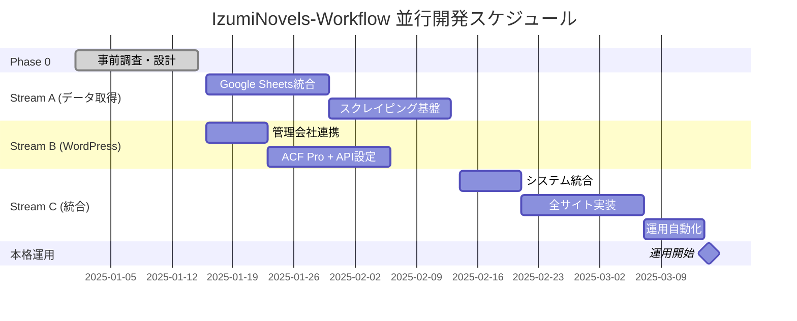

# IzumiNovels-Workflow 開発ロードマップ

**文書バージョン**: 1.0  
**最終更新**: 2025-01-08  
**ステータス**: Phase 0 - 計画策定完了

---

## 📋 エグゼクティブサマリー

### プロジェクト概要
いずみノベルズの販売リンク収集業務を自動化し、社長の作業時間を月165分から15分（90%削減）に短縮するシステムを開発します。これにより年間100時間以上の時間を創出し、戦略的業務にリソースを集中できます。

### 投資とROI
- **初期投資**: 70-120万円（開発費）
- **運用コスト**: 月2万円（保守リテイナー）
- **効果**: 年間100+時間の創出、作業精度向上、即座のマーケティング開始

### 技術アーキテクチャ概要
```
Google Sheets → Python自動化システム → WordPress (ACF Pro) → 公開ページ
     ↑                ↓                        ↓
   N番号入力      11サイト検索           自動リンク更新
```

---

## 🎯 開発フェーズ詳細

### Phase 0: 事前調査・基盤設計 【完了済み】
**期間**: 2週間 (2025/01/01 - 2025/01/15)  
**予算**: 5-10万円  
**ステータス**: ✅ 完了

#### 完了事項
- [x] AI多重分析による技術的実現性検証（8/10信頼度）
- [x] WordPress既存環境調査（ACF Pro導入済み確認）
- [x] 11販売サイトの技術特性分析
- [x] プロジェクト環境整備・MIS統合

#### 成果物
- ✅ 技術分析レポート (`/docs/technical-analysis.md`)
- ✅ プロジェクト基盤設定 (`CLAUDE.md`, `README.md`)
- ✅ 3モデル合意による実装推奨決定

---

### 作業ストリーム再編成 【管理会社連携対応】

管理会社との連携が必要なため、以下の **並行作業ストリーム** に再構成：

#### Stream A: データ取得基盤確立 【独立実装】
**期間**: 4週間 (2025/01/16 - 2025/02/13)  
**予算**: 25-35万円  
**優先度**: 🔴 Critical  
**依存関係**: なし（完全独立実装）

**主要目標**:
1. **Google Sheets統合**: N番号→書籍データ取得
2. **スクレイピング基盤**: 11サイト検索システム
3. **データ検証・品質保証**: リンク有効性チェック

#### Stream B: WordPress統合基盤 【管理会社連携】
**期間**: 3週間 (2025/01/16 - 2025/02/06)  
**予算**: 15-20万円  
**優先度**: 🟡 High  
**依存関係**: 管理会社との調整・承認

**主要目標**:
1. **ACF Pro設定**: 販売リンク管理フィールド群
2. **REST API設定**: 認証・権限・エンドポイント
3. **投稿テンプレート**: 既存デザインとの統合

#### Stream C: 統合・完全自動化 【連続性重視】
**期間**: 3-4週間 (2025/02/14 - 2025/03/14)  
**予算**: 30-40万円  
**優先度**: 🟢 Medium  
**依存関係**: Stream A・B完了後

**主要目標**:
1. **A・B統合**: データフロー完全接続
2. **エラーハンドリング**: 障害時の自動復旧
3. **運用自動化**: スケジュール実行・監視

### Stream A: データ取得基盤確立 詳細タスク

#### 週1-2: Google Sheets + Python基盤構築
- [ ] **開発環境構築**
  - Python 3.8+ 仮想環境設定
  - 依存関係管理 (requirements.txt)
  - 設定ファイル・ログシステム
- [ ] **Google Sheets統合**
  - API認証設定（サービスアカウント）
  - N番号→書籍データマッピング
  - データ取得・更新ロジック

#### 週3-4: スクレイピングシステム実装
- [ ] **基盤アーキテクチャ**
  - モジュール化スクレイパー設計
  - Tier別実装（API/軽量/重量）
  - エラーハンドリング・再試行機能
- [ ] **3サイト実装**
  - Amazon Kindle (API優先)
  - 楽天Kobo (楽天ブックスAPI)
  - Google Play Books (Google Books API)

### Stream B: WordPress統合基盤 詳細タスク

#### 週1: 管理会社連携・要件確認
- [ ] **技術要件調整**
  - ACF Pro設定内容の確認・承認
  - REST API権限・セキュリティ要件
  - 既存テーマとの互換性確認
- [ ] **作業スケジュール調整**
  - 管理会社の作業可能時間
  - ステージング環境の準備

#### 週2-3: WordPress実装
- [ ] **ACF Pro設定** （管理会社実施）
  - カスタムフィールドグループ作成
  - 11サイト分フィールド定義
  - 投稿タイプ関連付け
- [ ] **REST API設定** （管理会社実施）
  - 認証トークン発行
  - エンドポイント有効化
  - セキュリティ・権限設定

### 並行作業ストリーム マイルストーン

#### Stream A マイルストーン
- 🎯 **MA.1**: Google Sheets統合完了（週2完了）
- 🎯 **MA.2**: 3サイトスクレイピング実装（週4完了）
- 🎯 **MA.3**: データ品質保証システム（週4完了）

#### Stream B マイルストーン  
- 🎯 **MB.1**: 管理会社連携・要件確定（週1完了）
- 🎯 **MB.2**: ACF Pro + REST API設定（週3完了）
- 🎯 **MB.3**: WordPress統合テスト（週3完了）

#### Stream C マイルストーン
- 🎯 **MC.1**: A・B統合接続（統合週1完了）
- 🎯 **MC.2**: エンドツーエンドテスト（統合週2完了）
- 🎯 **MC.3**: 本格運用開始（統合週4完了）

### 並行作業成功基準

#### Stream A 成功基準
- [ ] N番号からの書籍データ自動取得
- [ ] 3サイトのリンク収集（5分以内）
- [ ] データ品質チェック（重複・無効リンク検知）
- [ ] JSON形式での結果出力

#### Stream B 成功基準
- [ ] ACF Pro販売リンクフィールド完全設定
- [ ] REST API経由でのフィールド更新
- [ ] 既存テーマとの完全統合
- [ ] 管理会社による動作確認完了

---

### Stream C: 統合・完全自動化 詳細実装
**期間**: 3-4週間 (2025/02/14 - 2025/03/14)  
**予算**: 30-40万円  
**優先度**: 🟢 Medium

#### 前提条件
- Stream A: データ取得基盤完了
- Stream B: WordPress統合基盤完了
- 両システムの個別動作確認済み

#### 主要目標
1. **システム統合**: A・B間の完全データフロー
2. **残り8サイト実装**: 全11サイト対応完了
3. **運用自動化**: スケジュール実行・監視・アラート

#### 週1: システム統合実装
- [ ] **データフロー統合**
  - Stream A出力 → Stream B入力の接続
  - JSON形式データのACFフィールドマッピング
  - エラー時のフォールバック機能
- [ ] **エンドツーエンドテスト**
  - Googleシート → WordPress完全フロー
  - 3サイト統合動作確認
  - パフォーマンス測定・最適化

#### 週2: 中安定性サイト拡張（4サイト）
- [ ] **honto実装**
  - HTML構造解析・スクレイピング
  - 検索結果パース・リンク抽出
- [ ] **Apple Books実装**
  - iTunes Search API利用
  - または軽量スクレイピング実装
- [ ] **紀伊國屋書店実装**
  - Kinoppyサイト構造分析
  - 検索・商品ページ特定ロジック
- [ ] **Reader Store実装**
  - Sony系サイト対応
  - JavaScript動的コンテンツ処理

#### 週3: 低安定性サイト実装（4サイト）
- [ ] **BOOK☆WALKER実装**
  - Playwright + JavaScript実行
  - 動的コンテンツ・AJAX対応
- [ ] **ebookjapan実装**
  - Yahoo!系サイト・UI変更対策
  - Stealth Mode + プロキシ対応
- [ ] **BookLive実装**
  - 検索・商品ページ特定
  - レート制限・CAPTCHA対策
- [ ] **統合テスト**
  - 全11サイト同時実行
  - 負荷分散・並列処理最適化

#### 週4: 運用自動化・本格稼働
- [ ] **スケジュール実行**
  - cron/Task Scheduler設定
  - 新刊발売日の自動検知・実行
- [ ] **監視・アラートシステム**
  - 実行状況の自動レポート
  - エラー・異常時のSlack通知
  - 月次統計レポート生成
- [ ] **運用ドキュメント**
  - 操作マニュアル作成
  - トラブルシューティングガイド
  - 保守・更新手順書

#### Stream C 成果物・マイルストーン
- 🎯 **MC.1**: A・B統合システム稼働（週1完了）
- 🎯 **MC.2**: 中安定性4サイト追加（週2完了）
- 🎯 **MC.3**: 全11サイト対応完了（週3完了）
- 🎯 **MC.4**: 完全自動化・本格運用開始（週4完了）

---


---

## 🛠 技術スタック・アーキテクチャ

### 開発技術
```yaml
Backend:
  - Python 3.8+
  - Playwright/Selenium (ブラウザ自動化)
  - Requests/aiohttp (HTTP通信)
  - BeautifulSoup4 (HTML解析)

APIs:
  - Google Sheets API v4
  - WordPress REST API
  - Amazon Product Advertising API
  - 楽天ブックス API

Frontend:
  - WordPress (既存)
  - Advanced Custom Fields Pro

Infrastructure:
  - Linux/Windows VPS
  - cron/タスクスケジューラ
  - ログ管理システム
```

### システム構成図
```
┌─────────────────┐    ┌─────────────────┐    ┌─────────────────┐
│   Google        │    │   Python        │    │   WordPress     │
│   Sheets        │<──>│   Automation    │<──>│   + ACF Pro     │
│                 │    │   System        │    │                 │
│ • N番号管理     │    │ • 11サイト検索  │    │ • リンク管理    │
│ • 書籍情報      │    │ • URL抽出       │    │ • 自動投稿      │
│ • リンク記録    │    │ • エラー処理    │    │ • ページ生成    │
└─────────────────┘    └─────────────────┘    └─────────────────┘
                              │
                    ┌─────────────────┐
                    │   11販売サイト   │
                    │                 │
                    │ • Amazon        │
                    │ • 楽天Kobo      │
                    │ • BookWalker    │
                    │ • その他8サイト  │
                    └─────────────────┘
```

---

## 📊 品質基準・KPI

### パフォーマンス指標
| 項目 | 目標値 | 測定方法 |
|------|--------|----------|
| リンク収集時間 | 11サイト合計5分以内 | システムログ計測 |
| WordPress投稿時間 | 30秒以内 | API応答時間測定 |
| システム稼働率 | 95%以上 | 月次実行成功率 |
| エラー率 | 5%以下 | 失敗ケース/総実行数 |

### 品質基準
- **信頼性**: 自動復旧・グレースフル・デグラデーション
- **保守性**: モジュール化・ログ完備・ドキュメント整備
- **拡張性**: 新サイト追加・機能拡張の容易性
- **セキュリティ**: 認証情報管理・アクセス制御

---

## 🚨 リスク管理・対策

### 技術的リスク

| リスク | 影響度 | 発生確率 | 対策 |
|--------|--------|----------|------|
| サイト構造変更 | 高 | 中 | 月次保守・監視アラート |
| CAPTCHA/Bot対策 | 中 | 中 | プロキシ・Stealth Mode |
| API制限・変更 | 中 | 低 | 複数API併用・フォールバック |
| WordPress更新影響 | 低 | 低 | ステージング環境・テスト |

### 事業継続性リスク

| リスク | 影響度 | 発生確率 | 対策 |
|--------|--------|----------|------|
| 開発会社依存 | 高 | 低 | 包括的ドキュメント・コード移管 |
| 保守費用上昇 | 中 | 中 | 月次リテイナー契約・予算確保 |
| 技術陳腐化 | 低 | 低 | 定期技術レビュー・アップデート |

---

## 💰 予算・コスト詳細

### 初期開発費
```
Phase 1: 30-50万円
  - WordPress統合: 10-15万円
  - Python基盤開発: 15-20万円
  - 3サイト実装: 5-15万円

Phase 2: 20-30万円
  - 3サイト追加: 10-15万円
  - 品質保証システム: 10-15万円

Phase 3: 20-40万円
  - 5サイト追加: 15-25万円
  - 自動化システム: 5-15万円

合計: 70-120万円
```

### 運用コスト（年間）
```
月次保守リテイナー: 2万円 × 12ヶ月 = 24万円
  - サイト構造変更対応
  - バグ修正・機能改善
  - 月次レポート作成

緊急修正費: 1-2万円 × 年2-3回 = 2-6万円
  - 予期しない障害対応
  - 急遽サイト変更対応

合計年間運用費: 26-30万円
```

---

## 📈 期待効果・ROI

### 定量的効果
- **時間削減**: 月165分 → 15分（90%削減）
- **年間時間創出**: 100+時間
- **作業精度向上**: 手動エラー排除
- **公開速度向上**: 即座のランディングページ生成

### 定性的効果
- **戦略業務への集中**: 新規企画・著者開拓
- **競争優位性**: 他社より迅速なマーケティング開始
- **ストレス軽減**: 反復作業からの解放
- **事業拡張性**: 新刊数増加への対応力

### ROI計算
```
初期投資: 70-120万円
年間運用費: 26-30万円
初年度総コスト: 96-150万円

社長時間価値: 3,000円/時間として
年間創出価値: 100時間 × 3,000円 = 30万円

※実際の機会費用（新規事業開発等）を考慮すると
年間価値: 100-300万円以上

投資回収期間: 1-2年
```

---

## 📅 実装スケジュール

### 2025年1月-3月 並行実装計画



### 並行作業マイルストーン一覧
- **M0**: 事前調査完了 (2025/01/15) ✅

#### Stream A (データ取得基盤)
- **MA.1**: Google Sheets統合完了 (2025/01/30)
- **MA.2**: 3サイトスクレイピング完了 (2025/02/13)
- **MA.3**: データ品質保証完了 (2025/02/13)

#### Stream B (WordPress統合)
- **MB.1**: 管理会社連携・要件確定 (2025/01/23)
- **MB.2**: ACF Pro + REST API完了 (2025/02/06)
- **MB.3**: WordPress統合テスト完了 (2025/02/06)

#### Stream C (統合・完全自動化)
- **MC.1**: A・B統合システム稼働 (2025/02/21)
- **MC.2**: 中安定性4サイト追加 (2025/02/28)
- **MC.3**: 全11サイト対応完了 (2025/03/07)
- **MC.4**: 本格運用開始 (2025/03/14)

#### 並行作業の利点
- **開発期間短縮**: 従来4ヶ月 → 2ヶ月
- **リスク分散**: 各ストリーム独立で障害局所化
- **管理会社負荷軽減**: 限定的な作業期間（3週間）

---

## 🔄 保守・運用計画

### 定期保守項目
#### 月次作業
- [ ] 全11サイトの動作確認
- [ ] エラーログ・パフォーマンス分析
- [ ] サイト構造変更チェック
- [ ] 月次レポート作成・提出

#### 四半期作業
- [ ] システム全体のパフォーマンス評価
- [ ] セキュリティアップデート
- [ ] 新機能・改善提案
- [ ] バックアップ・災害復旧テスト

### 緊急対応体制
- **レベル1** (軽微): 営業日48時間以内対応
- **レベル2** (重要): 営業日24時間以内対応  
- **レベル3** (緊急): 即日対応

### 長期保守計画
- **年次技術レビュー**: 技術スタック・アーキテクチャ見直し
- **拡張性評価**: 新サイト追加・機能拡張検討
- **コスト最適化**: 効率化・自動化のさらなる推進

---

## 📋 成功基準・完了条件

### Stream A完了条件
- [ ] N番号からの自動書籍データ取得
- [ ] 3サイトのリンク自動収集（5分以内）
- [ ] データ品質チェック（重複・無効検知）
- [ ] JSON形式での結果出力
- [ ] 基本的なエラーハンドリング

### Stream B完了条件
- [ ] ACF Pro販売リンクフィールド完全設定
- [ ] REST API経由フィールド更新機能
- [ ] 既存テーマとの完全統合
- [ ] 管理会社による動作確認・承認
- [ ] セキュリティ・権限設定完了

### Stream C完了条件
- [ ] A・B間の完全データフロー
- [ ] 全11サイト対応での安定動作
- [ ] 完全自動化での月3回実行
- [ ] 総合成功率95%以上達成
- [ ] 運用ドキュメント・保守体制完備

### 並行作業の成功条件
- [ ] 各ストリーム独立での動作確認
- [ ] 管理会社との円滑な連携・調整
- [ ] 統合時の互換性・データ整合性保証

### プロジェクト成功基準
- [ ] **効率化目標達成**: 90%作業時間削減
- [ ] **品質目標達成**: エラー率5%以下
- [ ] **安定性目標達成**: 稼働率95%以上
- [ ] **ROI目標達成**: 2年以内の投資回収

---

## 📞 連絡先・責任者

### プロジェクト体制
- **プロジェクトオーナー**: いずみノベルズ社長
- **開発責任者**: 外部委託先（選定中）
- **技術アドバイザー**: Claude Code + AI分析チーム

### 文書管理
- **文書責任者**: プロジェクトオーナー
- **更新頻度**: 月次または重要変更時
- **バージョン管理**: Git + ドキュメント履歴

---

**文書最終更新**: 2025-01-08  
**次回レビュー予定**: 2025-02-01  
**承認**: いずみノベルズ社長 (承認待ち)